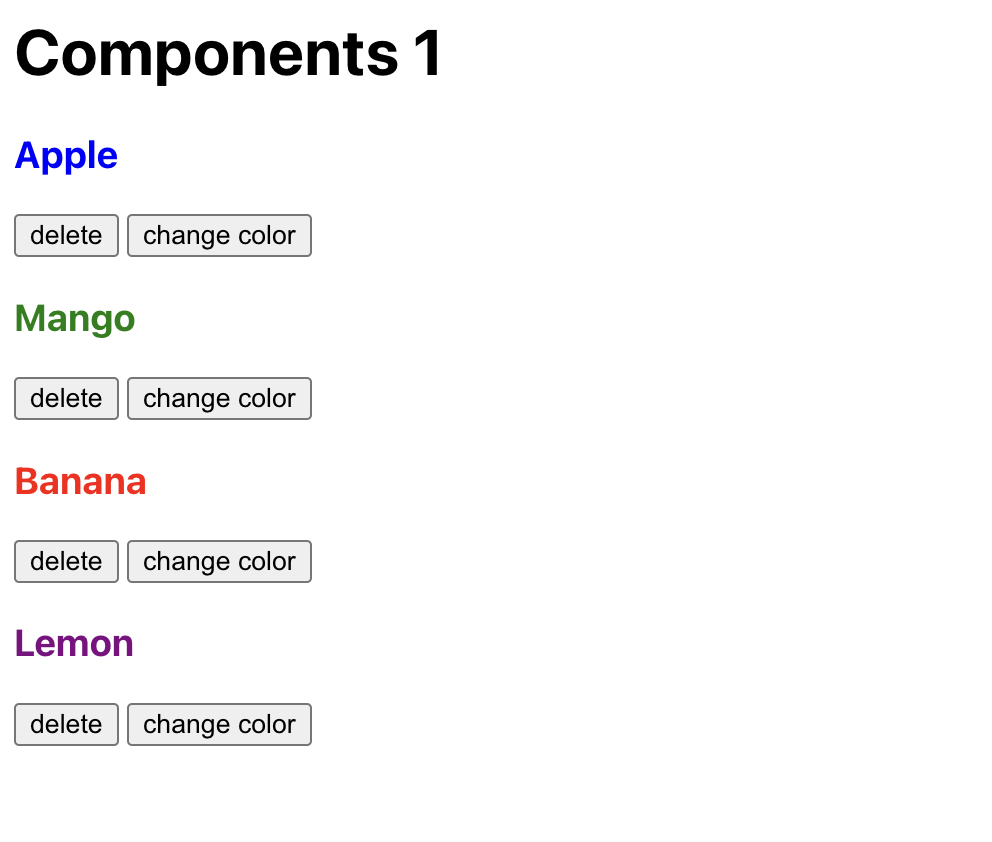

## Instructions for students:

### Create a Fruit Component

- Use the existing files `src/components/Fruit.js` to define the Fruit component
- Using your component, add 4 fruits to `src/App.js`
- The name of each fruit should have a random text color from this list: `["red", "blue", "green", "yellow", "purple"]`
- The user should be able to click the "change color" which should change the text color randomly to another color from the list.
- The user should be able to click the "delete fruit" button to remove a fruit

- image for reference:

**Bonus**

- The user should have the option to delete all

### Rules

- This is an individual assignment.
- Deadline: 1 hour.
- Use **Git properly**
- Feel free to document your code with comments.