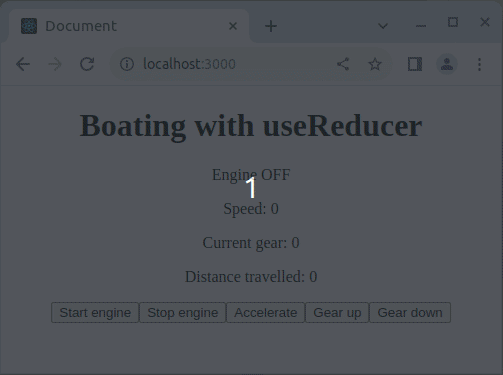

# A boat with useReducer

I want you to create a boat interface using `useReducer`. Don't create new components.

## Example

## Requirements

### User Interface

Your UI should have the following buttons

- "Start engine"
- "Accelerate"
- "Stop engine"
- "Gear up"
- "Gear down"

Also, show the current speed of the boat to the user.

### Reducer actions

Your reducer function should be able to do the following actions:

- Start the boat engine
- Stop the boat engine
    - also resets gear to 0
    - does not change the boat speed
- Change engine gear up
    - only works if engine is started
    - max gear 5
- Change engine gear down
    - only works if engine is started
    - min gear -2
- Increase boat speed
    - only works if engine is started
    - if gear is 0, has no effect
    - changes boat speed according to the current bge
    - gear 1 increases speed by 10
    - gear 5 increases speed by 50
    - gear -2 decreases speed by 20

Dispatch the reducer functions by clicking the UI buttons.

## BONUS CHALLENGE

Show distance traveled